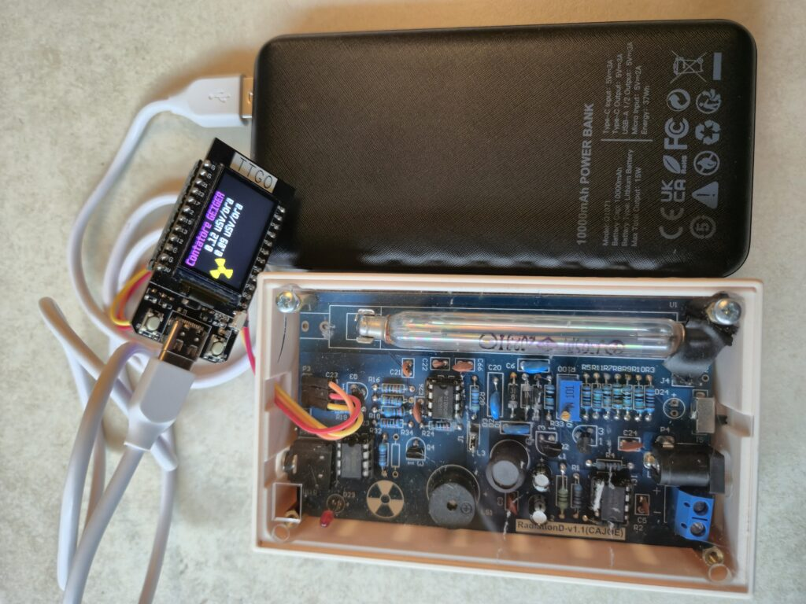

# ESPHome Contatore Geiger

Implementazione ESPHome per il contatore Geiger con LILYGO T-Display e modulo CAJOE RadiationD v1.1.


*Dispositivo completo assemblato: LILYGO T-Display ESP32, modulo CAJOE RadiationD v1.1 in case trasparente, e battery pack per utilizzo portatile*

## Panoramica

Questa versione ESPHome del contatore Geiger fornisce integrazione diretta con Home Assistant e include un display grafico avanzato con grafico a barre in tempo reale delle misurazioni di radiazioni.

### Contesto del Progetto

Questo progetto nasce nell'ambito di **BergamoScienza**, un'iniziativa educativa sviluppata da [FabLab Bergamo](https://www.fablabbergamo.it/2025/10/05/caccia-alla-radioattivita-un-progetto-scolastico-per-bergamoscienza/), con l'obiettivo di creare un rilevatore di radioattività economico e accessibile per scopi didattici.

**Obiettivi principali:**
- Dimostrare tecniche di misurazione della radioattività
- Fornire esperienza pratica con elettronica e programmazione
- Spiegare principi di schermatura dalle radiazioni e legge dell'inverso del quadrato
- Creare strumento riproducibile per educazione scientifica

**Risultati sul campo:**
Durante test sul campo nell'area mineraria di Novazza, il dispositivo ha rilevato con successo campioni di minerali contenenti uranio, misurando livelli di radiazione da 0.08 a 7 µSv/h, dimostrando la sua efficacia per applicazioni didattiche reali.

## Caratteristiche

### Display e Visualizzazione
- **Display TFT ST7789**: 240x135 pixel con rotazione a 90°
- **Simbolo radioattivo**: Simbolo trefoil classico giallo animato
- **Media mobile 1 minuto**: Visualizzazione valore mediato su 60 campioni
- **Grafico a barre tempo reale**: 25 barre che mostrano la cronologia delle ultime 2 minuti (aggiornamento ogni 5 secondi)
- **Scala logaritmica**: Range 0.1-20 µSv/h con linee di riferimento
- **Codifica colori**: Verde (<1 µSv/h), Arancione (1-5 µSv/h), Rosso (>5 µSv/h)

### Misurazione e Sensori
- **Contatore impulsi**: Pin GPIO26 con rilevamento fronte di discesa
- **Aggiornamento**: 1 secondo per conteggi CPM
- **Media mobile**: Buffer circolare di 60 campioni per media 1 minuto
- **Fattore conversione**: 0.00332 µSv/h per CPM (specifico per tubo J305β)

### Integrazione Home Assistant
- **Sensore radiazioni**: Esportato automaticamente con stato `measurement`
- **API ESPHome**: Comunicazione diretta con HA
- **OTA Updates**: Aggiornamenti firmware wireless
- **WiFi**: Configurazione con fallback AP mode

## Configurazione Hardware

### Componenti Necessari

**Hardware principale:**
- **LILYGO T-Display ESP32** (~€9) - Microcontrollore con display integrato
- **CAJOE RadiationD v1.1** (~€30) - Kit Geiger con tubo J305β
- **Battery pack** (10000mAh raccomandato) - Per utilizzo portatile
- **Case stampato 3D** - Protezione e alloggiamento componenti

**Costo totale:** ~€40-50 (escluso case)

### Pin Assignment LILYGO T-Display
- **Display SPI**: SCLK=18, MOSI=19, CS=5, DC=16
- **Backlight**: GPIO4 (controllabile via switch)
- **Geiger Input**: GPIO26 (interrupt fronte di discesa)

### Collegamenti CAJOE RadiationD
Collegare ai morsetti P3:
- **+5V**: Alimentazione positiva
- **GND**: Massa
- **IMPULSO**: Segnale a GPIO26


*Forma d'onda tipica dell'impulso dal tubo Geiger misurata con oscilloscopio. Il segnale mostra un impulso negativo con durata ~338µs utilizzato per il conteggio degli eventi di radiazione.*

## File di Configurazione

### `esphome-lilygo-tdisplay-cajoe-geiger.yaml`

Configurazione principale ESPHome che include:

#### Componenti Principali
- `esphome`: Configurazione base con nome dispositivo
- `esp32`: Board featheresp32 con framework ESP-IDF
- `wifi`: Connessione WiFi con modalità AP di backup
- `api`: Integrazione Home Assistant
- `ota`: Aggiornamenti over-the-air

#### Font e Display
- **Font Roboto**: Due dimensioni (20px e 28px) con glifi estesi incluso simbolo µ
- **Display MIPI SPI**: Configurato per T-Display con rotazione 90°
- **Aggiornamento manuale**: Display aggiornato solo quando necessario per performance

#### Sensori e Logica
```yaml
sensor:
  - platform: pulse_counter  # Contatore impulsi Geiger
  - platform: template       # Sensore radiazioni mediato per HA
```

#### Variabili Globali
- `cps_history_1min[60]`: Buffer circolare per media mobile 1 minuto
- `bar_history[25]`: Cronologia per grafico a barre
- `cps_accumulator_5s`: Accumulatore per media 5 secondi

#### Timer e Interval
- **1s update**: Aggiornamento contatore e calcolo medie
- **5s interval**: Aggiornamento grafico a barre e shift cronologia

## Installazione

### Prerequisiti
1. **ESPHome installato** (via Home Assistant Add-on o pip)
2. **File secrets.yaml** con credenziali WiFi:
```yaml
wifi_ssid: "YourWiFiSSID"
wifi_password: "YourWiFiPassword"
```

### Procedura Deploy
1. Collegare LILYGO T-Display via USB
2. Compilare e caricare firmware:
```bash
esphome run esphome-lilygo-tdisplay-cajoe-geiger.yaml
```
3. Configurare WiFi se necessario
4. Aggiungere dispositivo in Home Assistant (auto-discovery)

### Calibrazione
Il fattore di conversione 0.00332 è specifico per il tubo J305β. Per calibrazione precisa:
1. Utilizzare sorgente radioattiva nota
2. Confrontare letture con strumento certificato
3. Aggiustare il fattore nel codice se necessario

## Funzionalità Avanzate

### Grafico a Barre Logaritmico
- **25 barre**: Cronologia ultimi 2 minuti (5s per barra)
- **Scala log**: Ottimizzata per range tipico radiazioni di fondo
- **Linee riferimento**: 0.1, 1.0, 10.0, 20.0 µSv/h
- **Shift automatico**: Nuovi dati spostano cronologia a sinistra

### Media Mobile Adattiva
- **Avvio graduale**: Mostra "attesa..." fino a 60 campioni
- **Buffer circolare**: Efficiente gestione memoria per media mobile
- **Aggiornamento real-time**: Nuovo campione ogni secondo

### Ottimizzazioni Performance
- **Aggiornamento manuale display**: Evita refresh inutili
- **Logging debug**: Tracciabilità valori per tuning
- **Gestione memoria**: Buffer statici per prevedibilità

## Monitoraggio e Debug

### Log ESPHome
```bash
esphome logs esphome-lilygo-tdisplay-cajoe-geiger.yaml
```

### Metriche Chiave
- `bargraph`: Log ogni 5s con valori media e campioni
- `sensor.radiation_1min_avg`: Valore pubblicato in Home Assistant
- **GPIO26 pulses**: Conteggio impulsi raw dal tubo Geiger

## Integrazione Home Assistant

### Sensore Automatico
Il dispositivo appare automaticamente in HA come:
- **Entità**: `sensor.ttgo_display_radiation_1min_average`
- **Unità**: µSv/h
- **Classe**: `measurement`
- **Icona**: `mdi:radioactive`

### Utilizzo Dashboard
```yaml
type: gauge
entity: sensor.ttgo_display_radiation_1min_average
min: 0
max: 2
needle: true
severity:
  green: 0
  yellow: 0.5
  red: 1.0
```

## Confronto con Versione MicroPython

| Aspetto | ESPHome | MicroPython |
|---------|---------|-------------|
| **Integrazione HA** | Nativa | Manuale |
| **OTA Updates** | Integrato | Manuale |
| **Display** | Avanzato con grafici | Base |
| **Performance** | Ottimizzata | Buona |
| **Complessità** | Media | Bassa |
| **Customizzazione** | Configurazione | Codice diretto |


*Versione MicroPython in sviluppo con Thonny IDE, mostrando il codice sorgente e il plotter in tempo reale delle misurazioni di radiazione (µSv/h e media). Questa versione è stata utilizzata per i test iniziali e la validazione del progetto.*

## Note Tecniche

### Conversione CPM → µSv/h
Il fattore 0.00332 è derivato dalle specifiche del tubo J305β per dose assorbita in tessuti biologici. Rappresenta la conversione standard per radiazioni gamma da conteggi per minuto a microsievert per ora.

### Gestione Interrupt
ESPHome gestisce automaticamente gli interrupt GPIO con debouncing hardware, fornendo conteggi più accurati rispetto all'implementazione software.

### Memoria e Stabilità
L'utilizzo di buffer statici e gestione deterministica della memoria garantisce stabilità a lungo termine senza memory leak.

## Sicurezza e Uso Educativo

### Protocolli di Sicurezza
Quando si lavora con materiali radioattivi, anche a bassa intensità:
- Mantenere sempre la distanza massima possibile dalle sorgenti
- La distanza è il metodo primario di protezione dalle radiazioni
- Seguire le linee guida per la manipolazione di campioni minerali
- Non raccogliere o conservare materiali radioattivi senza adeguate precauzioni

### Applicazioni Didattiche
Il dispositivo è ideale per:
- Dimostrazioni in classe di fisica delle radiazioni
- Progetti STEM di elettronica e programmazione
- Misurazioni ambientali di radiazioni di fondo
- Studio della legge dell'inverso del quadrato
- Esperimenti su schermatura dalle radiazioni

### Range Tipici di Misurazione
- **Radiazione di fondo naturale**: 0.08-0.30 µSv/h
- **Materiali da costruzione**: 0.10-0.50 µSv/h
- **Minerali contenenti uranio**: 1.0-20+ µSv/h
- **Limite raccomandato esposizione pubblica**: <1 mSv/anno (equivalente a ~0.11 µSv/h continua)

## Riproducibilità e Open Source

Questo progetto è completamente open source e riproducibile:
- **Codice sorgente**: Disponibile su [GitHub](https://github.com/yourusername/contatore-geiger)
- **Lista materiali**: Tutti i componenti sono facilmente reperibili
- **Documentazione completa**: Istruzioni dettagliate per assemblaggio e configurazione
- **Community support**: Contributi e miglioramenti benvenuti

Per maggiori informazioni sul progetto educativo BergamoScienza, visita [FabLab Bergamo](https://www.fablabbergamo.it/).